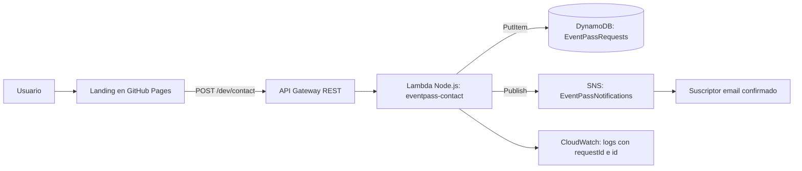

# EventPass

Reto 10 de Serverless AWS: landing para registrar interés en un encuentro tecnológico. Es una demostración educativa; registrar interés no garantiza una plaza.

- Frontend: https://gaabsito.github.io/eventpass/
- API: `POST https://dl3kveh7jg.execute-api.us-west-2.amazonaws.com/dev/contact`
- Región: `us-west-2`; stage: `dev`.

## Arquitectura



El frontend es estático y utiliza tres campos: `name`, `email`, `interest`. Lambda interpreta el evento HTTP y valida los datos incluso si se evita el HTML. Primero persiste y después publica; son operaciones independientes, no una transacción entre servicios.

## Probar

```bash
curl -i -X POST https://dl3kveh7jg.execute-api.us-west-2.amazonaws.com/dev/contact \
  -H 'Content-Type: application/json' \
  -d '{"name":"Prueba","email":"prueba@example.com","interest":"Cloud & Serverless"}'
```

Esperado: HTTP 201, `success`, `id` y `requestId`. Localiza el mismo `id` en DynamoDB, logs y notificación SNS. La suscripción email tiene que estar confirmada para recibir mensajes. Envía datos ficticios en las pruebas.

Errores comprobados: falta de `interest`, email inválido y JSON inválido devuelven 400. La evidencia está en `evidencias/`.

## Modelo y decisiones

- Partition key `id`: UUID nuevo para cada solicitud. Permite recuperar una solicitud por referencia y evita colisiones o concentrar escrituras por evento. No impone unicidad de email ni evita duplicados por reintentos.
- Atributos: `id`, `name`, `email`, `interest`, `timestamp`, `requestId`.
- DynamoDB encaja con insertar solicitudes independientes y recuperarlas por ID. Consultar por evento/email requeriría índices; relaciones y consultas complejas pueden justificar otro modelo o una base relacional.
- SNS desacopla Lambda de las direcciones destinatarias: Lambda conoce el topic; SNS distribuye a los suscriptores.
- Stage `dev`: entorno de demostración. POST crea una solicitud; OPTIONS atiende el preflight CORS del navegador.
- 201: guardado y publicación SNS completos. 400: datos inválidos. 500: falla la persistencia. 202: solicitud guardada pero falla SNS; se informa al usuario para que no repita el envío y duplique el registro.
- Publicar en SNS no demuestra entrega al email; la evidencia final debe verificar ambos.

## Identidades y permisos

Las credenciales temporales AWS Academy permiten al alumno desplegar. No se guardan en este repositorio ni se envían al navegador.

Lambda utiliza el Execution Role existente `LabRole`. Para esta aplicación necesita `dynamodb:PutItem` sobre EventPassRequests, `sns:Publish` sobre EventPassNotifications y escritura de logs en CloudWatch. Se reutiliza el role que proporciona el laboratorio, sin crear ni añadir permisos administrativos. El rol preexistente puede tener más permisos que los mínimos descritos; fuera del laboratorio conviene un rol dedicado restringido a estos recursos.

API Gateway necesita además permiso basado en recurso `lambda:InvokeFunction` sobre eventpass-contact, limitado al ARN de esta API. Es distinto del Execution Role.

CORS permite el origen `https://gaabsito.github.io`. CORS no autentica usuarios ni evita peticiones fuera del navegador. La API es pública para esta práctica; un servicio real necesitaría controles de abuso y privacidad antes de recibir datos reales.

## Diagnóstico para la defensa

| Síntoma | Qué revisar |
|---|---|
| 400 | JSON, campos y email; logs `validation_failed` |
| 403/404 | URL, método POST, ruta y stage; permisos API → Lambda |
| 500 | CloudWatch `persistence_failed`, tabla/región y Execution Role |
| 202 | CloudWatch `notification_failed`, topic y `sns:Publish` |
| CORS | OPTIONS y cabeceras de la respuesta, origen de Pages |
| AccessDenied | Identidad que hizo la acción y permiso específico |
| ResourceNotFound | Nombre del recurso y región |
| SNS publica pero no llega correo | Suscripción confirmada, topic correcto y spam |

Explica una solicitud concreta usando `requestId` y `id`: navegador → API → Lambda → item → Publish → correo. Los logs evitan registrar el formulario completo; SNS y DynamoDB sí conservan sus datos.

## Código y Terraform

- `frontend/`: HTML, CSS y JavaScript; `config.js` contiene únicamente la URL pública.
- `infra/lambda/index.mjs`: backend Node.js con SDK de AWS incluido en el runtime.
- `infra/`: configuración Terraform con AWS provider fijado por el lockfile.
- `.github/workflows/pages.yml`: publica exclusivamente frontend en Pages.

Para reconstruir desde `infra/`, usa credenciales Academy válidas y el role real de tu laboratorio:

```bash
cd infra
(cd lambda && zip function.zip index.mjs)
terraform init
terraform fmt -check
terraform validate
terraform plan -out=review.tfplan
terraform apply review.tfplan
terraform output
```

`terraform.tfvars` contiene región y ARN del role (identificadores, no secretos); ajústalos si usas otra cuenta. Actualiza `frontend/config.js` con el nuevo output `api_url` si reconstruyes. El estado y el ZIP no se versionan. Conserva el state local para gestionar correctamente los recursos.

La suscripción email se crea y confirma por separado. Para limpiar al terminar la evaluación, revisa `terraform plan -destroy` antes de `terraform destroy`: eliminará los recursos EventPass y sus solicitudes. No ejecutes limpieza antes de la corrección. El ciclo completo plan/apply/prueba/destroy se realizó previamente en el bloque 9 con los recursos de prueba terminados en TF.

## Estado de verificación

- Infraestructura desplegada tras revisar plan de 14 creaciones.
- POST válido 201; tres pruebas inválidas 400; CORS verificado.
- Suscripción EventPass solicitada: pendiente de confirmar y verificar entrega final.
- Evidencias adicionales de frontend, registro, logs y correo se incorporan al cerrar la prueba completa.
